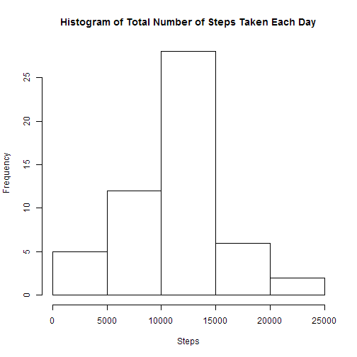
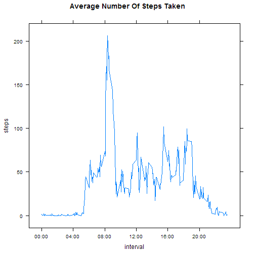
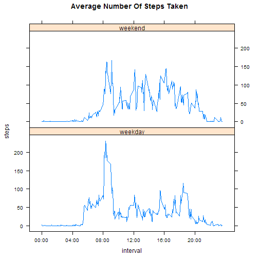

# Reproducible Research: Peer Assessment 1


## Loading and preprocessing the data

```r
setwd("c:/jay/rstuff/RepData_PeerAssessment1")
library(lattice)
library(ggplot2)

aData <- read.csv("activity.csv")
aData$date <- as.Date(aData$date)
```


## What is mean total number of steps taken per day?

```r
tSteps <- aggregate(steps ~ date, data = aData, sum)
hist(tSteps$steps,xlab="Steps",main="Histogram of Total Number of Steps Taken Each Day")
```

 

```r
mn <- sprintf("%5.2f",mean(tSteps$steps))
mdn <- median(tSteps$steps)
```
1. The mean total number of steps taken per day is 10766.19
1. The median total number of steps taken per day is 10765  

## What is the average daily activity pattern?

```r
int_tSteps <- aggregate(steps ~ interval, data = aData, mean)

#Make Timestamps Prettier
ts = seq(1, 288, 48)

int_tSteps$timestamp <- strptime(sprintf("%04d",int_tSteps$interval),"%H%M")
scalesList <- list(x = list(labels = format(int_tSteps$timestamp[ts],"%H:%M"), at = int_tSteps$interval[ts]))

xyplot(steps ~ interval, data = int_tSteps, type ="l", main="Average Number Of Steps Taken", scales = scalesList)
```

 

```r
maxsteps <- format(int_tSteps[which.max(int_tSteps$steps),3],"%H:%M")
maxsteps2 <- format(int_tSteps[which.max(int_tSteps$steps) + 1,3],"%H:%M")
maxstepsd <- sprintf("%3.2f", int_tSteps[which.max(int_tSteps$steps),2])
```
1. The 5-minute interval, on average across all the days in the dataset, containing the maximum number of steps is 08:35 to 08:40 with 206.17 steps

## Imputing missing values

```r
mv <- sum(is.na(aData$steps))

# Let's Use Mean Steps For Each 5-minute interval
meanSteps <- aggregate(steps ~ interval, data = aData, mean)
names(meanSteps)[2] <- "asteps"
adj_aData <- merge(aData,meanSteps,by = "interval")
adj_aData$steps <- ifelse(is.na(adj_aData$steps),adj_aData$asteps,adj_aData$steps)

adj_tSteps <- aggregate(steps ~ date, data = adj_aData, sum)
amn <- sprintf("%5.2f", mean(adj_tSteps$steps))
amdn <- sprintf("%5.2f", median(adj_tSteps$steps))

hist(adj_tSteps$steps,xlab="Steps",main="Histogram of Adjusted Total Number of Steps Taken Each Day")
```

 

**The missing values have been replace by the total mean for corresponding interval**

1. The  total number of missing values in the dataset is 2304
1. The adjusted mean total number of steps taken per day is 10766.19.
1. The adjusted median total number of steps taken per day is 10766.19.
1. As compared to the previous dataset, the mean has not changed, and the median has minimally increased.

## Are there differences in activity patterns between weekdays and weekends?

```r
adj_aData$whatday <- ifelse(weekdays(adj_aData$date) %in% c("Saturday", "Sunday"),"weekend","weekday")
adj_int_tSteps <- aggregate(steps ~ interval + whatday, data = adj_aData, mean)

#Make Intervals Prettier
adj_int_tSteps$timestamp <- strptime(sprintf("%04d",adj_int_tSteps$interval),"%H%M")
scalesList <- list(x = list(labels = format(adj_int_tSteps$timestamp[ts],"%H:%M"), at = adj_int_tSteps$interval[ts]))


xyplot(steps ~ interval | whatday, data = adj_int_tSteps, layout = c(1,2), type ="l", main="Average Number Of Steps Taken", scales = scalesList)
```

 
